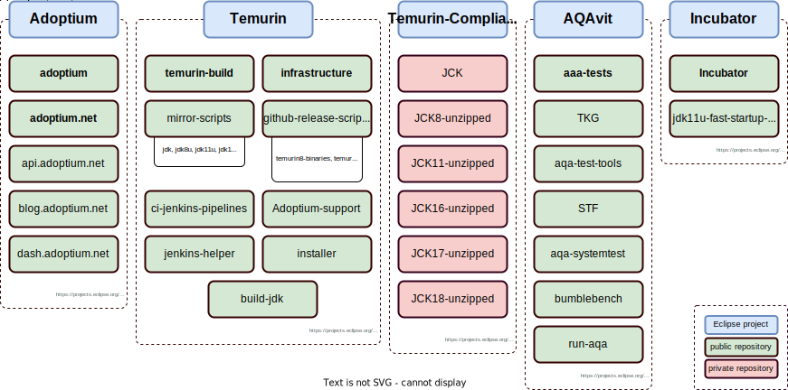

# Eclipse Adoptium

This organization provides a home for Git repositories that contain the activities of the Adoptium Working Group, the Eclipse Adoptium Top Level Project and several Eclipse projects that fall under that top level project:

* The [Eclipse Adoptium top level project](https://projects.eclipse.org/projects/adoptium).
* The [Eclipse Adoptium incubator project](https://projects.eclipse.org/projects/adoptium.incubator).
* The [Eclipse AQAvit project](https://projects.eclipse.org/projects/adoptium.aqavit).
* The [Eclipse Temurin project](https://projects.eclipse.org/projects/adoptium.temurin).
* The [Eclipse Temurin Compliance project](https://projects.eclipse.org/projects/adoptium.temurin-compliance).
* The [Eclipse Mission Control project](https://projects.eclipse.org/projects/adoptium.mc).

**NOTE:** The high-level project and issue tracking across all projects is kept in the [Adoptium repo issue tracking](https://www.github.com/adoptium/adoptium/issues) system.

----

Please see the [Eclipse Adoptium Project](https://projects.eclipse.org/projects/adoptium) description for more information regarding the Adoptium top-level project or its sub-projects (visually depicted in the diagram below).

## Eclipse Adoptium Working Group

The Adoptium Working Group promotes and supports high-quality runtimes and associated technology for use across the Java ecosystem.
Our vision is to meet the needs of Eclipse and the broader Java community by providing a marketplace for high-quality Java runtimes for
Java-based applications. We embrace existing standards and a wide variety of hardware and cloud platforms.

## Eclipse Adoptium Top Level Project

The mission of the Eclipse Adoptium Top-Level Project is to distribute high-quality runtimes and associated technology for use within the Java ecosystem.  We achieve this through a set of Projects under the [Adoptium Project Management Committee (PMC)](https://projects.eclipse.org/projects/adoptium/who) and a close working partnership with external projects, most notably OpenJDK for providing the Java SE runtime implementation. Our goal is to meet the needs of both the Eclipse community and broader runtime users by providing a comprehensive set of technologies around runtimes for Java applications that operate alongside existing standards, infrastructures, and cloud platforms.

## Eclipse AQAvit project

AQAvit is the quality and runtime branding evaluation project for Java SE runtimes and associated technology.  During a release it takes a functionally complete Java runtime and ensures that all the additional qualities are present that make it suitable for production use.  These quality criteria include good performance, exceptional security, resilience and endurance, and the ability to pass a wide variety of application test suites.  In addition to verifying that functionally complete runtimes are release ready, the AQA tests may also serve to verify new functionality during runtime development.

## Eclipse Temurin project

The Eclipse Temurin project provides code and processes that support the building of runtime binaries and associated technologies that are high performance, enterprise-caliber, cross-platform, open-source licensed, and Java SE TCK-tested for general use across the Java ecosystem.

## Eclipse Temurin Compliance project

The Eclipse Temurin Compliance project is responsible for obtaining, managing, and executing the Oracle Java SE Compatibility Kit (JCK) on Eclipse Temurin binaries.  The work is done on private infrastructure and using code managed in closed repositories only available to committers of Temurin Compliance.  The public artefacts produced by this project are limited to an indication of whether a particular Eclipse Temurin binary is Java SE compliant or not.

## Eclipse Mission Control project

Eclipse Mission Control enables you to monitor and manage Java applications without introducing the performance overhead normally associated with these types of tools. It uses data collected for normal adaptive dynamic optimization of the Java Virtual Machine (JVM). Besides minimizing the performance overhead, this approach eliminates the problem of the observer effect, which occurs when monitoring tools alter the execution characteristics of the system.
